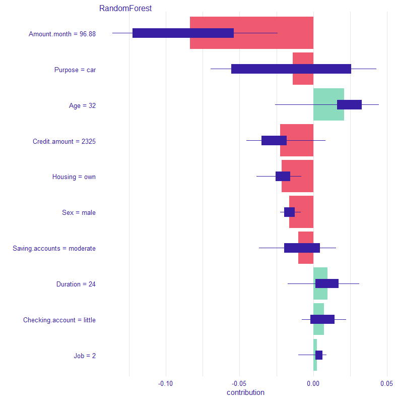
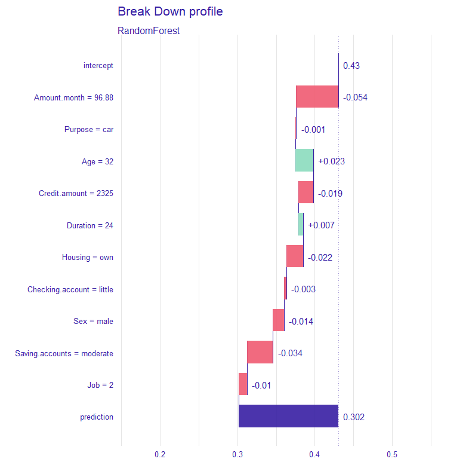
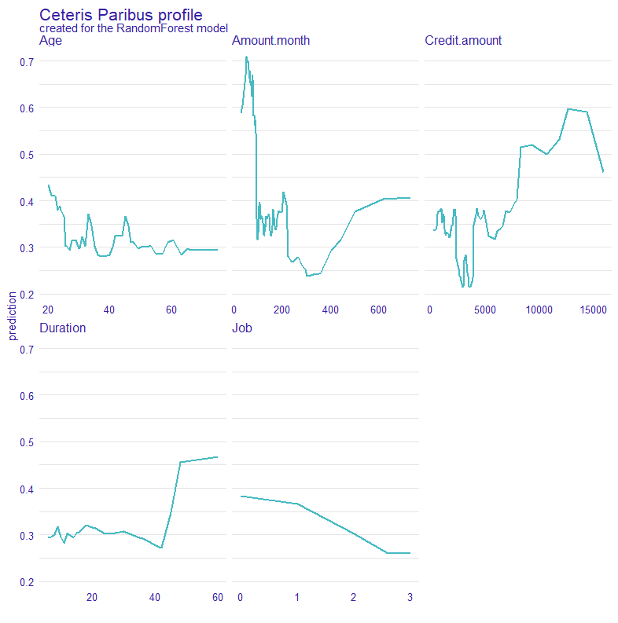
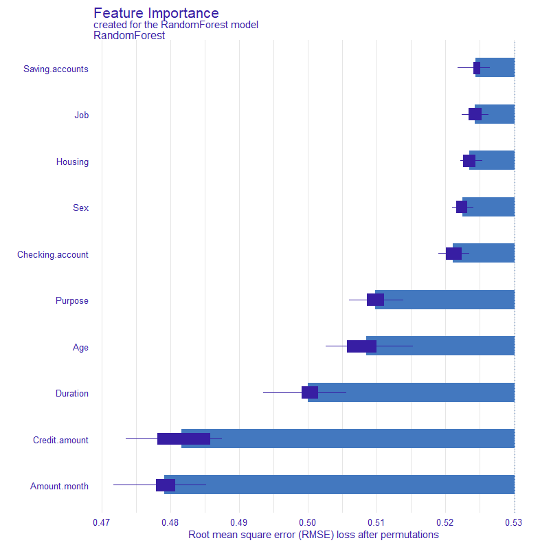
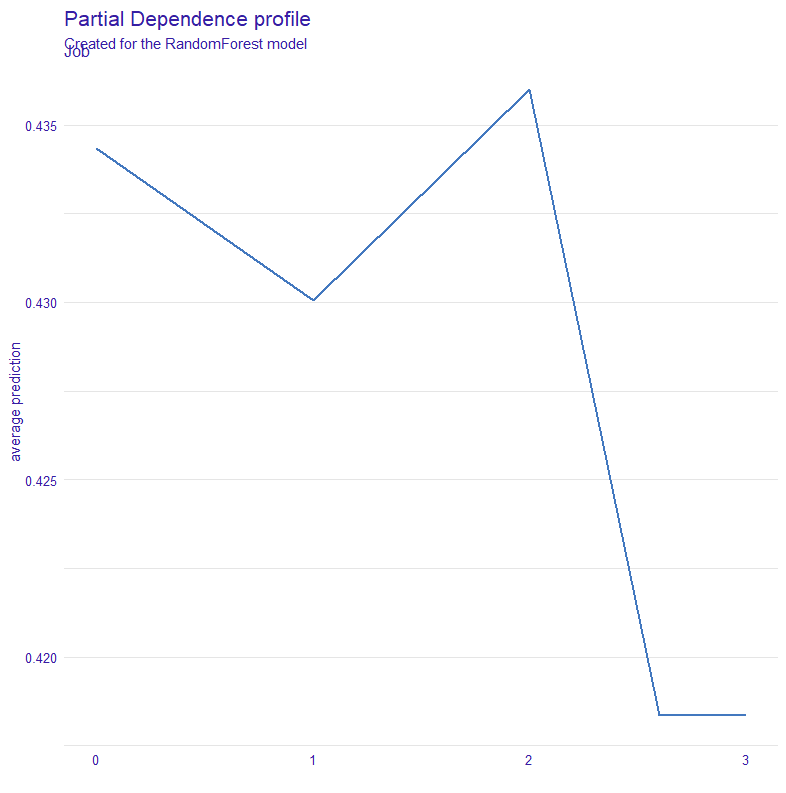

# Model explainability en fairness

## bugs
- print niet de plots direct uit script. moeten nog los gecalled worden.

## Packages

Er wordt gebruik gemaakt van de volgende packages:

- [DALEX](https://modeloriented.github.io/DALEX/)  

- [DALEXtra](https://modeloriented.github.io/DALEXtra/)

- [fairmodels](https://modeloriented.github.io/fairmodels/)

Simpel te installeren met behulp van dit command:

        install.packages(c("DALEX", "DALEXtra", "fairmodels"))

## Functies
Het voornaamste doel van deze repo is het uitvoeren van de scripts. Toch is er ook een mogelijkheid om de functies naar eigen wens te gebruiken. De volgende functies zijn aanwezig.

### explainability

#### Instance level

#### Dataset level

### Fairness

## Gebruik

#### Explainability

Voor dat het gebruik van de explainability en fairness scripts mogelijk is moeten er eerst twee functies gecalled worden.

    make_vars(<model>, <training_data>, <target_variable>, <label>, <PDP_variable>, <seed>)

make_vars wordt gebruikt voor de explainability en maakt gebruik van de volgende parameters:

- model
    - fitted model.
- training_data
    - data die ook gebruikt is voor het trainen.
- target_variable
    - variabele die moet worden bepaald.

- label (optioneel)
- PDP_variable (optioneel)
    - variabele die wordt uigelegd in de partial dependency plot.
- seed (optioneel)
    - custom seed. standaard staat op 123.

#### Fairness

    make_fairness_vars(<explainer>, <protected>, <privileged>, <cutoff>)
    
make_fairness_vars wordt gebruikt voor de fairness en maakt gebruik van de volgende parameters:

- explainer
- protected
- privileged
- cutoff (optioneel)

Deze functies zorgen ervoor dat de data onder de juiste variabelen komen te staan zodat het script zonder errors kan draaien.

## Voorbeeld
In dit voorbeeld wordt gebruik gemaakt van de German Credit Risk dataset. Deze dataset is te vinden op [kaggle](https://www.kaggle.com/uciml/german-credit).

    source('scripts/explainability/functions.R')
    make_vars(model_fitted2, GCR_train, "Risk", label = 'RandomForest', PDP_variable = 'Job', seed = 123)   
    source('scripts/explainability/script.R') 

    source('scripts/fairness/functions.R')
    make_fairness_vars(explainer, GCR_train$Sex, "male", 0.5)
    source('scripts/fairness/script.R')

### Explainability plots
Deze plots gelden uitsluitend als voorbeeld. 
Er is niet gekeken naar eventuele positieve of negatieve behandelingen van subgroepen.

     

     

     

     
### fairness plots

